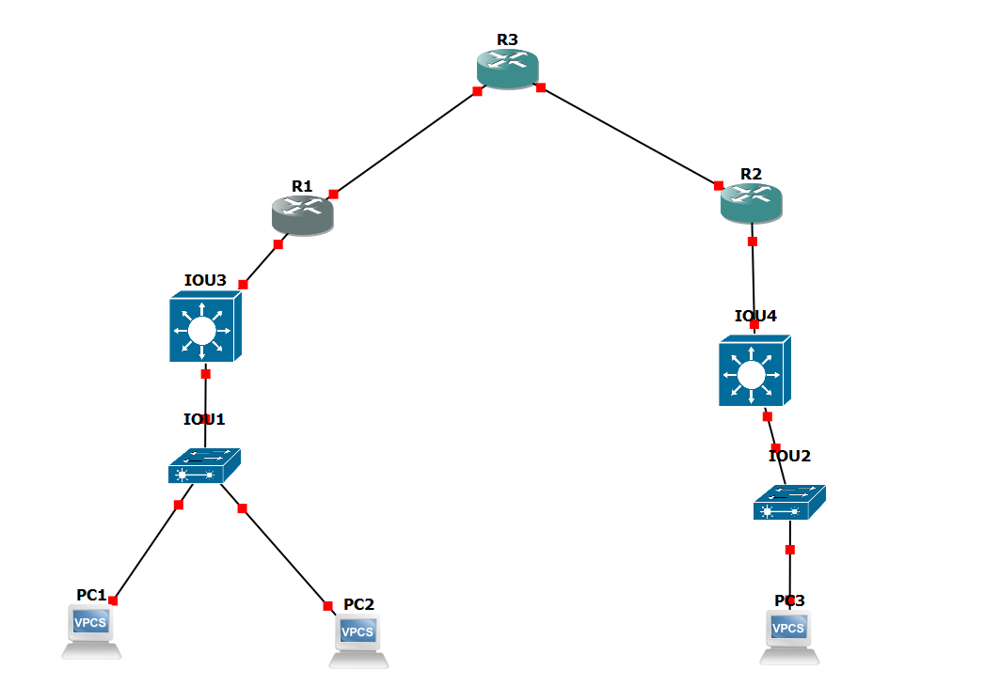

# GRE

Let say I'm a company with many remote site. I want to connect all my site together over the internet and make them act like a huge LAN. One way to make this possibility is to use GRE. Generic routing encapsulation (GRE) is a protocol that encapsulate network data packets into another protocol. This can be useful if the packet I want to send to another network isn't supported by edge device in between me and the end device. GRE can creates a point to point connection between 2 remotes routers. You can also use GRE to encapsulate IPV4 packets within a IPV6 header which allows IPV4 traffic to IPV6 only network and vice versa.

GRE adds 2 headers packet to your payload. First it adds a <b>GRE Header</b>.This 4 bytes header is used to add information like the ip protocol inside the payload and flags. The other header is the <b>Delivery Header</b>. This 20 bytes headers is used to add new source and destination IP address of my local GRE device and the endpoint GRE device.

Tho GRE is great there are some inconveniences. GRE doesn't have encryption by default so it can be a security risk. Because the default MTU value for most device is 1500 and GRE adds 24 bytes this might cause problem with performance. Because of this we usually use GRE with other protocols.

# IPsec

IP security (IPsec) is a group of protocols used to protect packets over network such as the internet. It provides 3 main advatanges. It offers encryption, authentication and integrity of the actual packets beings sent and received. 

<b>How does it work?</b> Before anything start both IPsec device must agree on how to communicate. The internet key exchange phase or (IKE) start by agreeing on encryption method then they exchange cryptographic keys for a way to authenticate themselves and safely communicate. Once they created a secure channel, the devices will negotiates another set of rules. The Security associations (SA) will be used to define how the data will be protected. Two main protocol are used to handle this protection.

<b>Authentic header (AH) : </b> provides data integrity but doesn't encrypt the payload.

<b> Encapsulation security payload (ESP) : </b> provides data integrity while also encrypt all of the data.

These protocol works in on of 2 different ways.

<b>Transport mode :</b> Only the data section of the IP packet will be encrypted. The original IP header will be visible. Widely used in end to end communication.

<b>Tunnel mode :</b> The entire original packet will be encrypted and placed into a new IP packet. Widely used in site to site connection. 

</br>Once you are done configuring your IPsec policies, you just have to put them in your GRE tunnel. With both IPsec and GRE you will be able to connects 2 different site and as if they were connected to each other directly while still putting a big emphasis on security.

# Configuration



This is my gns3 topology. I am going to show how to configure GRE/IPsec between R1 and R2 as R3 act as a ISP router. I will use IOU3 and IOU4 to add and test more ospf enable device. PC 2 and 3 will be in the same vlan but PC will be on a different one to test if routing still work perfectly from site to site. This might cause a problem with same vlan and subnet interaction from site to site but I will explain it later. To solve this problem i will have to add another tunnel for layer 2.

## topology

| Equipment | subnet |
|----------|---------|
| IOU1 | vlan 10 10.10.10/24, vlan 20 10.10.20.X/24, vlan 30 10.10.30.X/24 vlan 100 10.10.100.X/24 |
| IOU2 | vlan 20 10.10.20.X/24, vlan 40 10.10.40.X/24, vlan 2 10.10.X.X/23, vlan 200 10.10.200.X/24 |
| IOU3 |  10 10.10.10./24, 10.10.20.X/24, 10.10.30.X/24 10.10.100.X/24, 10.10.150.X/24 |
| IOU4 |  10.10.20.X/24, 10.10.40.X/24, 10.10.X.X/23 10.10.200.X/24 10.10.250.X/24 |
| R1 | 10.10.150.X/24, tunnel 172.16.0.X/30, Public IP 17.17.17.X/30 |
| R2 | 10.10.250.X/24, tunnel 172.16.0.X/30, Public IP 18.18.18.X/30 |
| R3 | Public 1 17.17.17.X/30, Public 2 18.18.18.X/30 |

I will need to configure nating on R1 and R2. I will need to configure ospf and add the tunnel subnet to ospf I will. I can test if it works by doing the `show ip ospf database` to ensure both sites are connected. There is a problem with nating and IPsec need to be more specif and overlapping vlan cause a big problem skip that nat for now

To start I made basic network configuration for both sites and configure ospf (I also added gre tunnel subnet to ospf). after that I configured R3 to act as my ISP router. The only route it has are the directly connected interface routes so it will be able to route traffic from site to site public IP. Since GRE takes care of my site to site routing I will need to configure a ACL to nat all outgoing traffic not destined to the remote site. Here is how i configured my nat rules.

```
ip access-list extended NAT_TRANS
 deny   ip 10.10.0.0 0.0.255.255 10.10.0.0 0.0.255.255
 permit ip 10.10.0.0 0.0.255.255 any
ip nat inside source list NAT_TRANS interface g1/0 overload
```

## GRE tunnel

To configure GRE we need 3 essential options. We need are WAN interface IP, the Remote site WAN interface IP and add a IP address to the subnet. Here is how i configured mine.

```
interface tunnel1
 ip add 172.16.0.1 255.255.255.252
 tunnel source 17.17.17.2
 tunnel destination 18.18.18.2
 ip mtu 1400
 ip tcp adjust-mss 1360
exit 
```

Since IPsec and GRE adds additional headers (bytes) this might cause packets to go over mtu default maximum 1500 limit. So by lowering MTU and MSS on tunnel it shrink the data before the additional headers are apply which prevent fragmentation. After doing this on both edge routers, your internal routing protocol (ospf for me) should link site A and site B. You will be able to ping and the ospf database will be updated. But we still need to encrypt our tunnel with ipsec.

## IPsec Ikev2

To configure IPsec you will have to decide between Internet key exchange version 1 also know as <b>IKEv1</b> (ISAKMP) or <b>IKEv2</b>. I would suggest to always choose version 2 unless your routers doesn't support the newer version.

To start off I will separate the IPsec configuration into 2-3 different part.

### Channel negotiation

Here is a basic guide with some comments on how to configure the channel negotiation part of ipsec. Depending on what encryption algorithm you used the integrity option might not be needed. also Instead of using password authentication you can use digital certification to make it more secure but it requires some different configuration options.

```
!proposal
crypto ikev2 proposal IKEV2-PROP   ! naming proposal 
 encryption aes-cbc-256            !encryption algorithm used
 integrity sha256                  ! checksum for integrity of packets
 group 14                          ! Diffie-Hellman group. Higher numbers usually stronger
exit

!policy
crypto ikev2 policy IKEV2-POLICY  ! Naming policy
 no match fvrf any                ! Disable catch all
 proposal IKEV2-PROP              ! links proposal options to this policy
exit

!keyring
crypto ikev2 keyring KEYRING-A                ! Creates the secure   vault (keyring) to store VPN passwords
 peer ROUTER-R2                               ! Remote name
  address 18.18.18.2                          ! Remote Wan IP
  pre-shared-key local R1localpassword        ! Used for asymmetric auth
  pre-shared-key remote R2localpassword       ! Used for asymmetric auth
 exit
exit

! profile
crypto ikev2 profile IKEV2-PROFILE-A     ! Naming profile
 match identity remote address 18.18.18.2 255.255.255.255        ! Identify who is allowed to use this profile
 identity local address 17.17.17.2       ! Identify local IP used for identifying 
 authentication remote pre-share         ! Remote router must identify using pre shared key
 authentication local pre-share          ! Local router must identify using pre shared key
 keyring local KEYRING-A
 lifetime 3600                           ! Set time in seconds before rekeying is required
exit
```

### Encryption mode

In this section I will choose between AH and ESP and also choose my mode of encryption. I will also finish up my IPsec configuration

```
crypto ipsec transform-set GRE-SET esp-aes 256 esp-sha256-hmac      ! Defines the Phase 2 parameters, encrypting data payloads with 256-bit AES and verifying integrity via SHA-256 HMAC.
    mode transport          ! Encrypts only the payload not the IP Header.
exit

! Links configuration option to final profile
crypto ipsec profile IPSEC-TUNNEL-PROFILE
 set transform-set GRE-SET
 set ikev2-profile IKEV2-PROFILE-A
 set pfs group14            ! additional security feature
exit
```

### GRE over IPsec

The last part of this set up is to apply the final profile to our GRE tunnel. This is how you do it.

```
interface tunnel1
 tunnel protection ipsec profile IPSEC-TUNNEL-PROFILE
exit
```

## Troubleshooting

Like me you might encounter some problem with Ipsec, gre or even how ospf work with all of them. Here are somme troubleshooting commands I used to help me solve my problem.

```
! verify Ipsec and ikev2 status
show crypto ipsec sa
show crypto ikev2 sa

! GRE tunnel status
show interface tunnel 1

!Verify the IPsec/GRE Binding
show crypto socket

!Force channel renegotiation
clear crypto ikev2 sa

!Clear phase 2
clear crypto sa

!real time process
debug crypto ikev2
debug crypto ipsec
``` 

# Missing

GRE layer 2 for vlan 20 and digital certificate for authentication.
